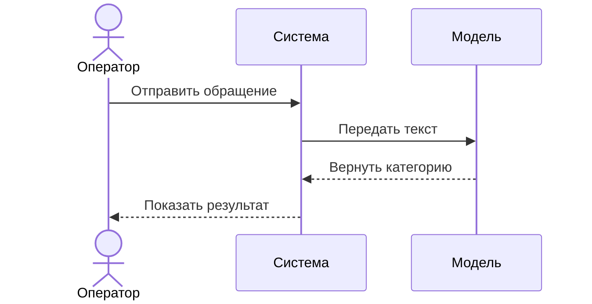
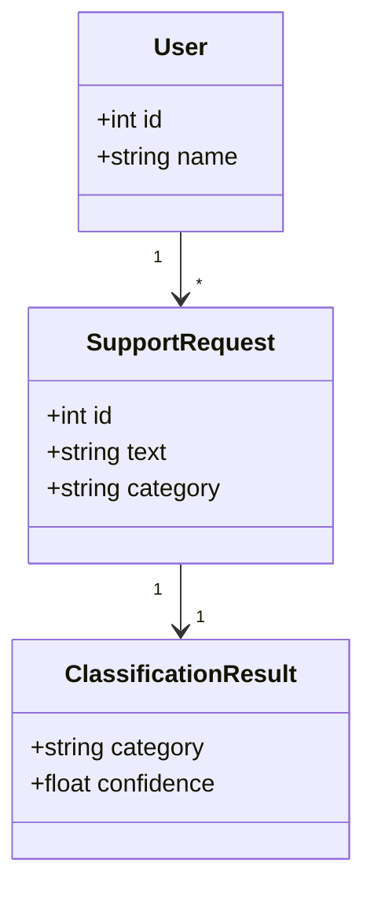

# Диаграммы

## Диаграмма последовательности

```mermaid
sequenceDiagram
    actor User as Оператор
    participant System as Система
    participant Model as Модель
    User->>System: Отправить обращение
    System->>Model: Передать текст
    Model-->>System: Вернуть категорию
    System-->>User: Показать результат
```

## Диаграмма классов

```mermaid
classDiagram
    class User {
        +int id
        +string name
    }
    class SupportRequest {
        +int id
        +string text
        +string category
    }
    class ClassificationResult {
        +string category
        +float confidence
    }
    User "1" --> "*" SupportRequest
    SupportRequest "1" --> "1" ClassificationResult
```